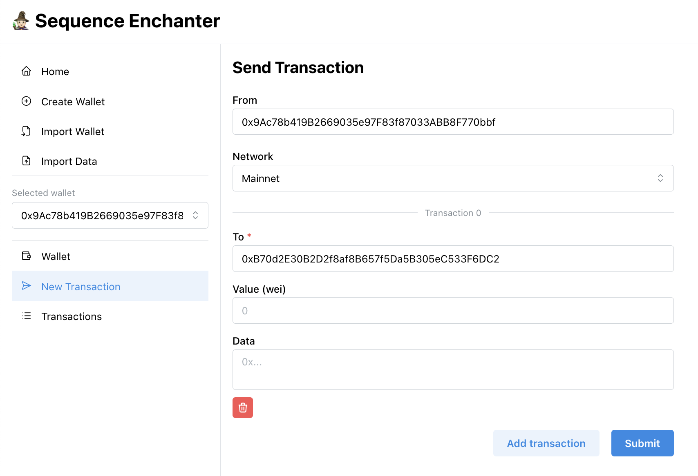

# 🧙🏻 Sequence Enchanter

The Sequence Enchanter is a Web Application that allows users to create and interact with Sequence Wallets. Sequence Wallets are Smart Contract Wallets that exist across all fully compatible EVM Networks.

## Running the Application

A hosted version of the application can be found at [tbd](tbd).

To run the application locally, follow these steps:

```
git clone https://github.com/0xsequence/enchanter.git

cd enchanter

pnpm install

pnpm dev
```

The application will be available at `http://localhost:5174`.



### Creating a Wallet

Creating a wallet is as simple as clicking the "Create Wallet" button on the home page. This will generate a new Sequence Wallet for you to interact with. The Sequence wallet is ready to be used from the moment it is created, there is no need to deploy it to the network.

By default, there is a list of compatible networks that the wallet can be used on. The wallet can be used on any network that is fully compatible with the EVM, if the network is not listed, please double check compatibility before using the wallet.

Wallets can be imported by other users just by sharing the wallet address, notice that the name of the wallet is not shared, it is only stored locally on the user's device.

#### Wallet Salt

Sequence Wallets are fully determinist, this means that two wallets with identical configurations will have the same address. To avoid this, Sequence implements a "salt" (internally mapped to the 'checkpoint' of the wallet). The salt randomizes the wallet address, making it unique.

By default the application will generate a different salt every second, making it in essence unique. A custom salt can be provided during wallet creation.

### Sending transactions

To send a transaction, click the "Send Transaction" button on the wallet page, notice that a wallet must be created/imported and selected before sending a transaction.

Transactions are order-independent by default, this means that they can be signed and executed in any order.

### Signing transactions

Transactions don't automatically synchronize across devices, when a transaction is signed on one device, the data of the transaction must be exported and imported on all other devices for the signatures to be synchronized. This can be done by clicking the "Export" and "Import" buttons on the transaction page.

